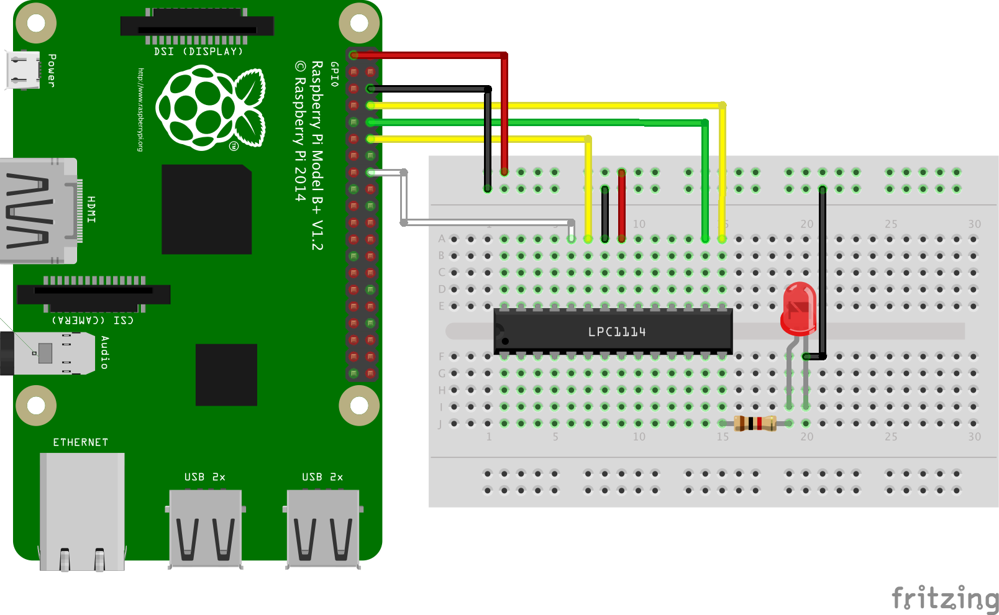

Raspberry Pi から LPC1114 への書き込み
---

* [Raspberry Pi](https://www.raspberrypi.org/)
* [LPC1114](http://www.nxp.com/products/microcontrollers-and-processors/arm-processors/lpc-mcus/lpc1100-cortex-m0-plus-m0/scalable-entry-level-32-bit-microcontroller-mcu-based-on-arm-cortex-m0-plus-m0-cores:LPC1114FN28)

# Raspberry Pi と LPC1114の配線

* [RPi_LPC1114](RPi_LPC1114.fzz)



# lpc21isp のコンパイル

## Download

* [lpc21isp](https://sourceforge.net/projects/lpc21isp/)

## Unarchive

```
$ tar xvzf ~/Downloads/lpc21isp_XXX.tar.gz
```

## Build

```
$ cd lpc21isp_XXX
$ make CFLAGS="-Wall -DGPIO_ISP=23 -DGPIO_RST=18"
```

# Raspberry Pi の GPIO のセットアップ

```
#!/bin/sh

# Configure -ISP signal
echo 23 >/sys/class/gpio/export
echo out >/sys/class/gpio/gpio23/direction
echo 1 >/sys/class/gpio/gpio23/value
chown root.gpio /sys/class/gpio/gpio23/value
chmod 660 /sys/class/gpio/gpio23/value

# Configure -RST signal
echo 18 >/sys/class/gpio/export
echo out >/sys/class/gpio/gpio18/direction
echo 1 >/sys/class/gpio/gpio18/value
chown root.gpio /sys/class/gpio/gpio18/value
chmod 660 /sys/class/gpio/gpio18/value
```

# プロジェクトの作成

[platformio](http://platformio.org/) を使ってビルドします

```
$ platformio init --board=lpc1114fn28
```

# コンパイル

```
$ platformio run
```

# 書き込み

```
lpc21isp -control -bin .pioenvs/lpc1114fn28/firmware.bin \
    /dev/ttyAMA0 115200 48000
```
